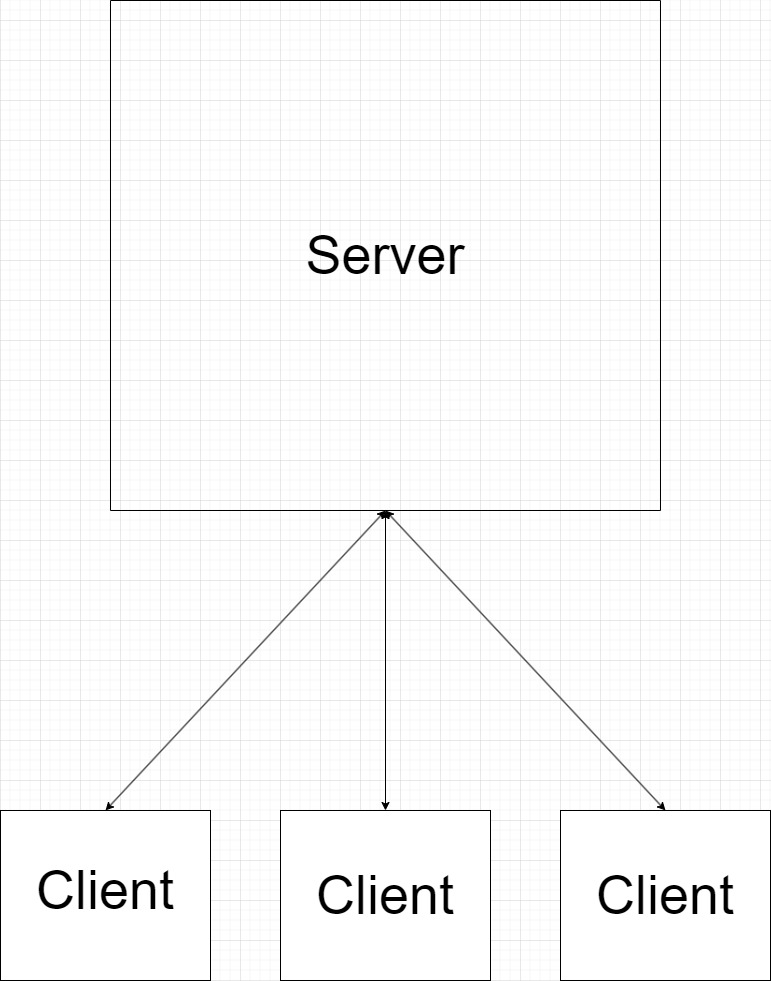
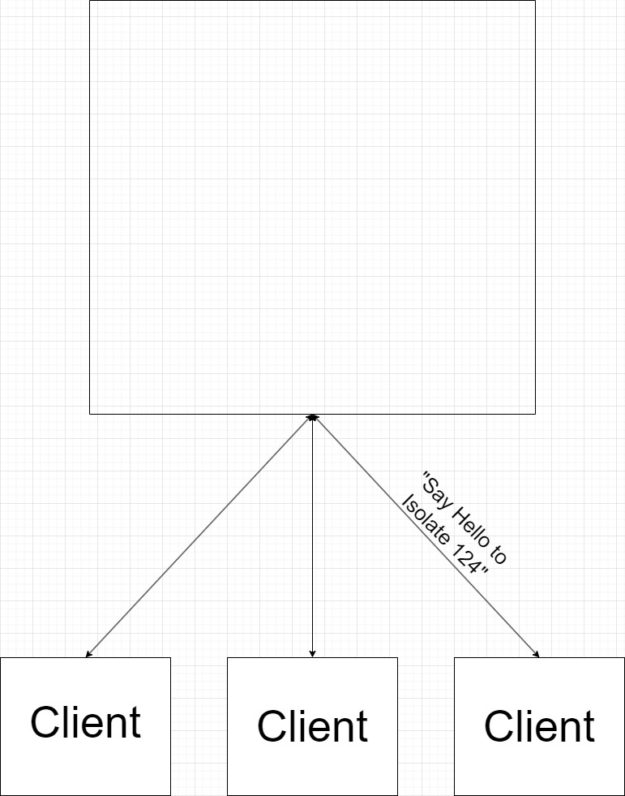
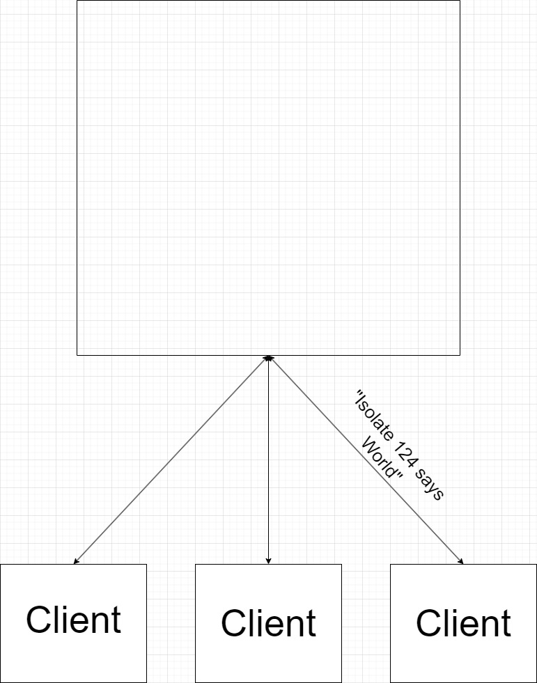

# DOTP - Derailed Open Telecommunications Platform

Erlang-like machine-to-machine communication in Python using asyncio, anyio, and sockets.

# Architecture

DOTP tries using simple socket-to-socket communication to communicate messages and events to other machines.

Every server dedicates itself to simply listen for new client messages and send new events or messages to clients. Most of the time these messages are responses to client messages.

Now let's say a client decides it wants to send a message to an isolate on another machine. Well firstly, the client would send it to the other machines server.

Then the server would churn and process that message and interact with its hosted isolate.

Then finally the server would send a response to the client, a response given by the isolate.

